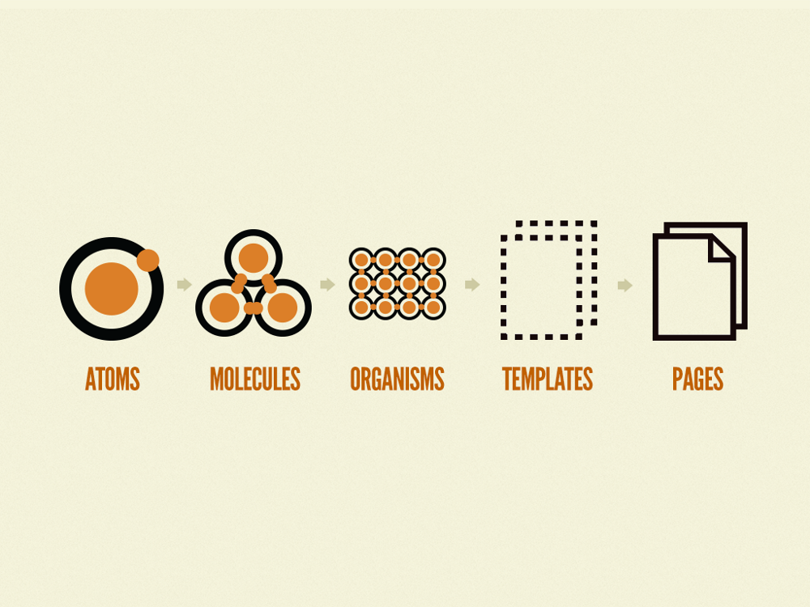

# Estructura del proyecto

* src
    - Codigo fuente de la aplicación.
    - No debe haber codigo auto-generado en esta carpeta.

* src --> App
    - La estructura sigue una filosofia basada en features y no en abstracciones logicas.
    - La carpeta views debe seguir la misma estructura que el routing de la app

* src --> App --> style
    - Se sigue una metodologia de trabajo **ITCSS**

* src --> App --> utils.*
    - Utilidades, funciones helpers categorizadas, por ejemplo:
        - utils.redux : utilidades relacionadas con redux.
        - utils.rendering: utilidades relacionadas con el renderizado, por ejemplo un capitalize.
        - utils.routing: utilidades relacionadas con el routing.
        - etc

* src --> App --> views
    - Feature centric, replica la estrucura de Routing.

# Atomic development

Como guia de diseño de componentes y estilos se seguirá la metodolgia de Atomic Development.

Por resumir tenemos 5 abstracciones en los que la agrupación del nivel inferior da lugar al nivel superior de abstracción.

- Un boton es un ATOM
- Un boton mas un input puede ser una MOLECULA cuadro de busqueda
- El cuadro de busqueda junto con un panel de navegación forman un ORGANISMO cabecera.
- Un conjunto de ORGANISMOS forman un TEMPLATE
- Las PAGES o paginas, son los templates concretos para nuestro producto.

* La estructura de la carpeta Shared refleja este tipo de diseño.
    * atm.nombreComponente --> Componente atomicos
    * mol.nombreComponente --> Componente molecula
    * org.nombreComponente --> Componente organismo

Además distinguimos también.

* hoc.nombreComponente --> higher order component. Una función que toma un componente existente y devuelve otro componente que lo envuelve.
* obj.nombreComponente --> los objetos manejan unicamente estructura y composición y deben ser agnosticos en cuanto al estilo.

# Otros principios de diseño

**LIFT**

* L : Localizar el codigo es facil.
* I : Identificar el codigo de un vistazo.
* F : Flat structure as long as we can (Estructura plana tanto como podamos)
* T : Try to stay DRY (dont repeat yourself)

**KISS**

* Keep It Simple
* Piensa siempre si vas a entender lo que estas escribiendo dentro de 3 meses.
* Piensa siempre si lo puede entender alguien con menos experiencia.
* Nombres auto-explicativos para variables y funciones.
* Comentarios en caso de peculiarideades o casos de negocio que no se entinden simplemente leyendo el codigo.

> Referencias:
> ITCSS https://www.xfive.co/blog/itcss-scalable-maintainable-css-architecture/
> Atomic web design  http://bradfrost.com/blog/post/atomic-web-design/